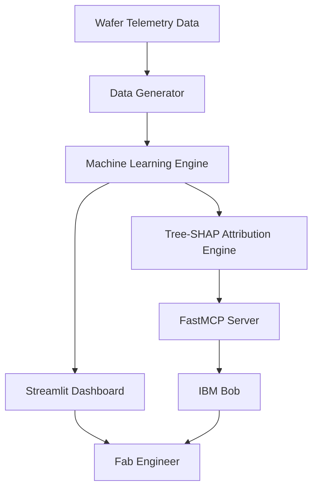

# Architecture

## System Architecture

WaferPulse implements a modular architecture that combines semiconductor telemetry analysis, explainable AI, and IBM Bob MCP integration.

## Components

| Component | Technology | Responsibility |
|-----------|------------|---------------|
| FabOps Dashboard | Streamlit | Displays wafer defects, yield metrics, and risk analysis |
| Data Layer | Pandas, CSV Files | Stores telemetry and wafer inspection data |
| Diagnostic Engine | Scikit-Learn | Performs root-cause analysis and yield prediction |
| Explainability Layer | Tree-SHAP | Ranks sensor parameters causing yield loss |
| MCP Server | FastMCP | Exposes diagnostic tools to IBM Bob |
| IBM Bob Integration | IBM Bob MCP | Provides conversational diagnostics and workflow automation |

## Data Flow

1. Wafer telemetry and process sensor data are collected and stored.
2. The machine learning engine predicts wafer yield and batch risk.
3. Tree-SHAP calculates feature importance and identifies root causes.
4. FastMCP exposes diagnostic functions to IBM Bob.
5. IBM Bob invokes diagnostic tools through MCP.
6. Results are displayed on the Streamlit dashboard.
7. Engineers receive recommendations for corrective actions and batch approval.

## Security Considerations

- Sensitive configuration values are stored outside source code.
- No credentials are hardcoded within the repository.
- MCP tools use structured input validation.
- Read-only access is used for analytics workflows.
- Environment variables are used for local configuration.

## Scalability Notes

- The system can be extended to support live semiconductor telemetry streams.
- Additional sensor channels can be incorporated without major architectural changes.
- FastMCP services can be migrated to remote deployments.
- The diagnostic engine can support larger fab datasets and distributed inference workloads.
- Future versions can integrate directly with manufacturing execution systems (MES).